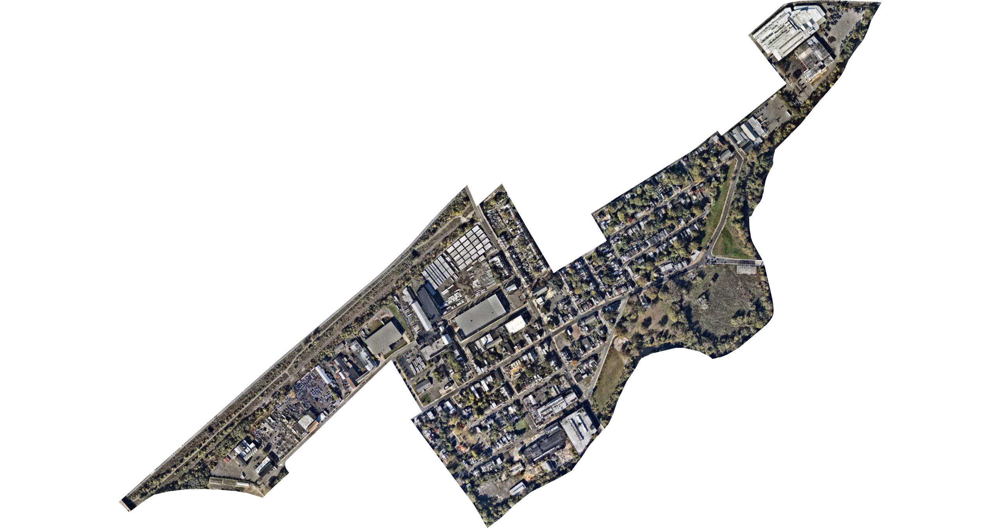

# goclipmaps

```goclipmaps``` is an experiment in clipping [Mapbox Static Map](https://www.mapbox.com/static-maps) images to GeoJSON features using pure Go. 

Inspired by the Twitter bot [@everytract](https://twitter.com/everytract/status/1382397269429907457) and the Glitch app [Ever Given Ever Ywhere](https://evergiven-everywhere.glitch.me/).


*Census Tract 19, Mercer County, New Jersey (34021001900)*

## What

A GeoJSON Polygon feature and its bounds are used to request a Mapbox Satellite image from the [Mapbox Static Image API](https://www.mapbox.com/static-maps). The image is then drawn onto a virtal SVG canvas. Next, the GeoJSON feature is converted into an SVG path string which is parsed into step-by-step path commands. Those path commands are fed into a vector rendering engine and the path is drawn onto a mask layer on the canvas above the image. Finally, the mask is clipped against the image.

## How

A couple of external packages were used in this experiment. 

The package [```engelsjk/geoviewport```](github.com/engelsjk/geoviewport) is used to calculate the bounds of the Mapbox Static Image API request to geographically center the image to the GeoJSON Feature. It was ported to Go from the JavaScript library [```mapbox/geo-viewport```](https://github.com/mapbox/geo-viewport). 

Next, [```engelsjk/geojson2svg```](https://github.com/engelsjk/geojson2svg) converts the GeoJSON Feature into SVG as an XML string. This package was forked from [```whosonfirst/go-geojson-svg```](https://github.com/whosonfirst/go-geojson-svg) to add additional functionality for extent and mercator options. 

The package [```JoshVarga/svgparser```](github.com/JoshVarga/svgparser) helps to parse the XML string in order to isolate the specific SVG path string.

Finally, [```engelsjk/svgg```](https://github.com/engelsjk/svgg) takes in the SVG path string, parses out each command and uses the [```fogleman/gg```](https://github.com/fogleman/gg) rendering engine to draw the paths to a canvas. ```engelsjk/svgg``` was forked from the raster rendering engine [```srwiley/oksvg```](https://github.com/srwiley/oksvg) and modified to draw SVG to ```fogleman/gg``` instead of a raster image.

## Caveats

* This clipping process is really only intended for GeoJSON Polygons but there are no safety checks on that at the moment.
* The package [```engelsjk/geojson2svg```](https://github.com/engelsjk/geojson2svg) is fairly untested at this point so it's unclear how robustly it handles the full scope of GeoJSON features.
* Similarly, the package [```engelsjk/svgg```](https://github.com/engelsjk/svgg) is very much a hack at the moment and it only works for drawing Polygons intended for clipping. Future development might include support for other feature types and allow for both clipping and general drawing.
