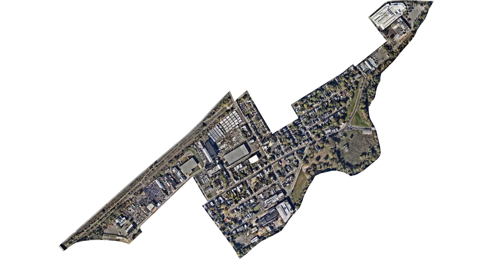

# goclipmaps

```goclipmaps``` is an experiment in clipping [Mapbox Static Map](https://www.mapbox.com/static-maps) images to GeoJSON features using pure Go. 

Inspired by the Twitter bot [@everytract](https://twitter.com/everytract/status/1382397269429907457).


*Census Tract 19, Mercer County, New Jersey (34021001900)*

## Install

```bash
go get github.com/engelsjk/goclipmaps/cmd/goclipmaps
```

## Usage

```bash
goclipmaps -shape test/shapes/34021001900.geojson -o 34021001900.png
```

You'll need an [access token](https://docs.mapbox.com/help/getting-started/access-tokens/) for the Mapbox Static Images API. This needs to be set as an environmental variable, available in a .env file, or set inline while running the command.

## What

A GeoJSON feature file is used as an input. The bounds of the feature are converted into a geoviewport in order to request a Mapbox Satellite image from the [Mapbox Static Image API](https://www.mapbox.com/static-maps). That image is then drawn onto a virtal SVG canvas. Next, the GeoJSON feature is converted into SVG path strings which are then parsed into step-by-step path commands. Those path commands are fed into a vector rendering engine and the path is drawn onto a mask layer on the canvas above the image. Finally, the vector mask is clipped against the original raster image.

## How

A couple of external packages were used in this experiment. 

The package [```engelsjk/geoviewport```](github.com/engelsjk/geoviewport) is used to calculate the bounds of the Mapbox Static Image API request to geographically center the image to the GeoJSON Feature. It was ported to Go from the JavaScript library [```mapbox/geo-viewport```](https://github.com/mapbox/geo-viewport). 

Next, [```engelsjk/geojson2svg```](https://github.com/engelsjk/geojson2svg) converts the GeoJSON Feature into SVG as an XML string. This package was forked from [```whosonfirst/go-geojson-svg```](https://github.com/whosonfirst/go-geojson-svg) to add additional functionality for extent and mercator options. 

The package [```JoshVarga/svgparser```](github.com/JoshVarga/svgparser) helps to parse the XML string in order to isolate the specific SVG path string.

Finally, [```engelsjk/svgg```](https://github.com/engelsjk/svgg) takes in the SVG path string, parses out each command and uses the [```fogleman/gg```](https://github.com/fogleman/gg) rendering engine to draw the paths to a canvas. ```engelsjk/svgg``` was forked from the raster rendering engine [```srwiley/oksvg```](https://github.com/srwiley/oksvg) and modified to draw SVG to ```fogleman/gg``` instead of a raster image.
